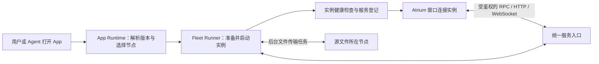

# Fleet App 统一运行模型与 Office 迁移方案

日期：2026-09-16

状态：分阶段实现中，尚未部署。Fleet 生命周期 v1、节点容器引擎依赖、Fleet 管理界面及可选 VM Workspace 配置已实现；Office 已有原生 Linux（默认）、macOS、Windows 平台制品，可选容器包和节点会话服务。Linux 和 Apple Silicon 已完成隔离运行验收；Intel Mac、Windows 真机验收待完成。跨节点 HTTP/WebSocket 入口、Office 窗口实例绑定和默认 Workspace 选择已实现；线上入口配置、旧 App Host 适配与现有 Office 会话迁移尚未完成。现有 Office 工作副本与本地服务在迁移验收前保留。

## 已落地与仍待接入

| 范围 | 当前状态 |
| --- | --- |
| install/start/stop/uninstall、钩子、操作记录、generation、重启恢复 | 已实现并测试，见生命周期文档中的 v1 契约 |
| 目标节点的容器引擎依赖 | 已实现。复用健康的本节点 Docker；缺失时由 Fleet 安装固定校验和的发行包，并实际运行测试容器 |
| Workspace 运行能力 | 原生 ONLYOFFICE 已在同类 Debian 12 gVisor 环境验证打开三种文档和 Word 编辑保存；无需嵌套 Docker。容器方式仍需支持 namespace 的节点 |
| Hub VM 配置 | `MODAL_WORKSPACE_VM=true`、`MODAL_WORKSPACE_VM_MEMORY_MB=8192`；仅影响新建 Workspace，保留旧节点，不自动中断用户会话 |
| Fleet UI / Agent | 节点上的安装、启动、停止、恢复和操作进度已接入；旧 Runner 明确显示升级提示 |
| Office 节点组件 | 默认原生进程包：安装钩子准备校验和锁定的 ONLYOFFICE、私有 nginx 和 Python 依赖，保留现有编辑器补丁；另保留可选容器包 |
| 浏览器→实例的统一 HTTP/WebSocket 入口、默认节点选择、Window attach | 已实现。独立 origin、分区 Cookie、实例授权、反向流式隧道；需要部署 wildcard DNS/TLS、Controller 和 Runner 后才能线上使用 |
| 现有 Office 从 Mac 迁到 Workspace | 尚未执行；不能据此宣称本地 Office Docker 已不再被使用 |

## 1. 产品约定

**App 声明它需要的环境；Fleet 在符合条件且允许使用的节点上管理 App 实例；Atrium 连接实例并显示窗口。**

- 同一个 App 可以在 Workspace、用户的 Mac、实验室服务器或平台提供的云端 Fleet 节点运行，前提是节点支持该 App 的运行环境、系统架构、资源和数据访问需求。
- “任意节点”不代表忽略操作系统、依赖、文件权限或持久存储条件。
- Workspace 是用户工作文件的位置，也可以是一个运行节点；不再是启动所有 App 的特殊父进程。
- 用户只安装和打开 Office。无需运行本地 Docker、填写文档服务地址或启动开发服务。
- Office 默认使用平台提供的合格云端节点；只有用户明确选择自己的节点时，才在该节点准备并运行 Office。
- 普通 App、系统服务和 Office 使用同一套实例、调度、路由和生命周期协议。底层可以有不同运行器。

## 2. 当前需要收敛的实现

| 当前实现 | 实际行为 | 迁移方向 |
| --- | --- | --- |
| `apps/desktop/app_supervisor.py` | Desktop 在自身进程所在机器创建打包 App 子进程，使用 stdio RPC | 保留后端协议，迁入 Fleet 的通用 App Host，由目标节点 Runner 监督 |
| `pantheon/apps/resolver.py` | 系统服务按能力调度；明确指定节点仅支持 Files、文件传输和 PTY | 统一经过 App Runtime 的节点选择与实例登记 |
| `pantheon/apps/spec.py` | 发送当前进程的 Python 绝对路径和源码路径 | 在目标节点根据制品和运行环境解析命令，不继承另一台机器的路径 |
| `fleet/internal/apps/supervisor.go` | 已有按节点启动、停止、列举和崩溃重启的基础 | 扩展为版本化实例协议，支持可验证的就绪状态和多种运行器 |
| Office 前端与 Hub Office API | 本地开发可直连 `127.0.0.1:5197`，文档服务器由全局 URL 配置 | 前端只持有实例/会话标识；服务端根据绑定找到 Office 组件 |
| ONLYOFFICE 本地容器 | 由开发脚本启动，未纳入 Fleet 实例生命周期 | 作为 Office App 的受管理运行组件发布、准备和启动 |

当前 manifest 把浏览器所需的 `dom` 与后端运行条件放在同一处，也容易造成误解。新模型明确区分 UI 表面和后端运行目标。改造需要进行 manifest/协议版本协商，旧 Runner 不得默默忽略新字段。

## 3. 用户需要理解的四个对象

| 对象 | 含义 | 不承担的职责 |
| --- | --- | --- |
| App | Store 中的应用定义、版本、代码/镜像、接口、skill 和运行条件 | 不指定某个人电脑的固定地址 |
| Node | 一个允许执行任务、报告能力并接入 Fleet 的运行位置 | 不自动拥有其他节点文件的访问权 |
| Instance | 某用户的某个 App 版本在某节点上的一次受管理运行 | 不等同于一个窗口或一份源文件 |
| Window | Atrium 中连接到 App 实例的视图 | 关闭窗口不等于删除实例或丢弃工作副本 |

Office 文档等 App 内部对象仍称 Session。Session 绑定 Instance；窗口可以断开并重新连接同一个 Session。

纯前端 App 仍在浏览器执行，不制造无意义的后台进程。对于有后端的 App，前端在浏览器、后端在所选节点，这是明确声明的组成方式。平台内部插件可以保留嵌入式执行，但不把它包装成用户可迁移的普通 App 后端。

## 4. 启动与连接

统一启动请求包含：App ID、不可变 revision、自动或指定的 Node、文件引用和已有 Session（可选）。调用方不提交任意可执行命令或自行指定后台 URL。构建后的启动参数只能由受信任的安装/运行层生成。

启动返回 operation ID，前端订阅统一的真实阶段：

`resolving → selecting → preparing → starting → ready`，失败进入 `failed` 并返回可处理的原因。

运行中的状态包括 `running / reconnecting / draining / stopped / failed`。启动请求幂等，重复点击或网络重试不会再启动一个相同实例。标识中包含用户、App、revision、scope 和绑定的 Node；不再只靠 App 名称或本机缓存判断实例是否存在。

窗口状态另行维护，例如 loading、ready、dirty。不能用“进程存在”冒充“App 可接收请求”，也不能用“窗口关闭”推断“工作已经保存”。

App Runtime 的协调部分放在现有 Hub 控制层：负责用户权限、版本解析、调度和实例索引；进程与容器的实际启动始终由目标节点 Runner 执行。它是清晰的职责边界，不要求再建立一个独立产品或第三套守护进程。

## 5. 节点选择和安装

先过滤硬条件，再按偏好排序：

1. 节点在该用户允许使用的 Fleet 范围内，并有新鲜的在线记录。
2. 节点允许执行此类 App，支持操作系统、架构及运行器；容器引擎必须实测可用，仅找到 `docker` 命令不算支持。
3. 资源、依赖、网络路由、显示能力和持久存储符合 App 要求。
4. 源文件可按用户授权访问；有可执行的数据准备方案。
5. 自动模式下优先复用兼容的已有实例，再考虑数据位置、已安装版本、资源余量及平台策略。Office 的默认策略选择平台云端节点。

用户指定 Node 是硬约束。指定节点不满足条件时，显示缺少什么，不静默切到另一台机器。自动模式也不能回退到不满足条件的节点。

制品准备在目标节点完成：

- 拉取精确 commit/digest 的应用包或镜像，并校验身份与完整性。
- 根据锁定的依赖准备隔离环境，缓存按制品版本键控。
- 工作目录、可执行文件路径、端口和环境变量在目标节点解析。
- 安装内容与用户数据分离；升级、卸载代码不删除工作副本。
- 首次准备可能较慢，进度明确显示；后续复用缓存或已就绪实例。

支持的执行方式是 `process`、`container` 和现有 `builtin`。它们是 Runner 的适配器，而不是三套面向前端的 App API。Office 默认采用原生 `process` 方式，由安装钩子准备节点依赖，不需要容器引擎。选择 `container` 的 App 仍声明容器引擎依赖，在选定节点配置、准备、验证；已存在的健康引擎直接复用。用户没有选择 Mac 时，不能借用 Mac 的 Docker。引擎共享且默认保留，卸载一个 App 不停止其他 App 的容器。

先升级支持版本协商的 Runner，再逐批迁移 App。不能简单去掉 `ensure_instance(node_id=...)` 的限制，因为当前路径、依赖、实例 ID 和数据访问方式还不支持这种直接放开。

## 6. 通用接口与路由

以下是目标协议的语义名称，尚不是当前可调用的 API：

- `app.resolve`：返回支持的运行目标、可用节点和不满足条件的原因。
- `app.install` / `app.uninstall`：准备或移除指定 Node 上的安装，卸载默认保留用户数据。
- `app.start` / `app.attach`：启动或连接实例；可指定 Node 和精确 revision。用户的“打开 App”流程组合 ensure installed、start 和 attach。
- `app.status` / `app.events` / `app.logs`：统一状态、进度和诊断信息。
- `app.call`：根据 instance ID 调用已登记的接口。
- `app.stop`：按该 App 的 drain 策略停止实例，保留持久状态。

install/start/stop/uninstall 的执行顺序、可选钩子、幂等、失败恢复与升级规则见 [生命周期与钩子契约](fleet-app-lifecycle.md)。生命周期由 Runner 控制，钩子仅处理 App 专有步骤。

App 窗口与 Agent 使用相同的实例接口。Desktop 不再根据 `module:Class` 和 `backend/__init__.py` 为调用方选择两种不同的生命周期路径。旧 stdio 后端由通用 App Host 适配，其代码不必一次全部重写。

接口描述必须标明执行目标。后端方法指向 `instance_id`；选中对象、缩放和编辑当前画布等前端操作指向 `window_id`。两者可以统一发现，但不能混淆执行位置。现有 Office 的细粒度段落/单元格接口作用于浏览器中的实时编辑器，仍需要已连接且就绪的窗口；后台转换、文件传输和保存任务则由实例负责。窗口不在线时应明确返回“需要连接编辑窗口”，不能伪装成后端已修改文档或无限排队。

HTTP、WebSocket、iframe 和原生流式窗口统一使用服务登记返回的受鉴权地址。连接入口可复用现有网络设施，但必须完成跨节点路由，而不是只给前端返回节点 localhost。

对 ONLYOFFICE，优先采用独立的服务 origin，隔离应用与 Atrium 的 Cookie，并正确处理原生资源路径、WebSocket 和回调地址。具体域名、入口和证书由部署配置提供；App 包内不写死。节点无需对公网直接开放端口，服务入口通过受鉴权的隧道或受控内部路由访问它。

## 7. 文件、状态与迁移

源文件使用明确的引用：`node_id + path + revision/expected_hash`。文件所在节点与 App 运行节点是两个独立字段。

- 同节点：在授权范围内读取或复制到实例工作目录。
- 跨节点：生成独立的后台传输任务，支持进度、取消和恢复；大文件不要求经浏览器内存转发。
- 编辑：使用持久工作副本，增量编辑先保留到工作副本。
- 保存：独立的后台任务生成完整输出，再按预期版本原子写回源节点；冲突保留双方内容。
- 源节点离线：继续保留已具备完整内容的工作副本，写回进入明确的等待/失败状态。不能报告原文件已保存。
- 关闭窗口：不终止已经提交给后台的加载和保存任务。浏览器退出也不应再是数据传输任务的生命周期边界。
- 停止实例：先进入 drain；有未完成保存或未持久化状态时不能自动强杀并丢弃内容。

“任意节点启动”与“正在编辑的实例无损迁移”分期实现。第一阶段允许选择节点启动、重新连接和故障恢复；活跃文档绑定原实例。没有经过持久化和租约切换验证之前，不自动迁移未保存的编辑会话。

节点本地存储必须准确标明可恢复范围，不能把“此节点重启后可恢复”宣称为“另一节点也可接管”。平台 Office 使用持久存储；跨节点恢复需要已上传的检查点、完整媒体及明确的单写者租约。

## 8. Office 的目标形态

Store 只展示一个 Office App。它声明：

- UI：浏览器中的 Office 窗口。
- 运行目标：经过验证的 ONLYOFFICE 镜像所支持的平台、容器运行器、资源和持久存储。
- 运行组件：Office 会话服务与修改版 ONLYOFFICE Document Server，作为一个受管理部署单元。
- 对外服务：编辑入口、会话 API、保存与后台任务接口。
- 接口/skill：保留现有细粒度内容接口；后台文件和会话接口通过实例暴露。

Office 默认放到平台云端 Fleet 节点。平台节点可以由现有基础设施供应，但必须走与用户节点一致的实例协议与权限检查，不能新增一个只有 Office 使用的“神秘服务器”路径。首版不承诺跨用户共用一个实例，避免将文档状态、密钥和生命周期混在一起。

一个用户实例可以托管多个文档 Session；多个窗口可以连接同一会话。实例按需启动，可保温；最后一个窗口关闭不立即杀掉文档服务。资源规格由支持的镜像实测得到，并由容量策略限制并发。

Hub 保留身份验证、运行请求、实例/会话索引和路由职责。现有 Office 编辑会话与文档处理逻辑迁入 Office 服务组件。这样 Hub 不需要按 App 启动裸进程，也不依赖全局固定 `OFFICE_DOCUMENT_SERVER_URL` 为全部会话找同一个服务。

会话记录必须保存 `instance_id`、Node、App revision 和文档引擎版本。配置、媒体 URL、回调和保存都按这个绑定查找服务，防止升级后旧会话被路由到错误实例。浏览器和目标实例使用范围受限的凭证；不把 Hub 管理凭证或所有用户的登录密钥传入 App。

现有渐进式 PPTX 读取、媒体复用、完整性校验、原生 File 菜单、主题和细粒度接口一起进入可复现的 Office 镜像与回归测试，不能退回未打补丁的标准镜像而声称完成迁移。

## 9. 前端应该展示什么

- Store App 详情：支持的运行环境、`运行于：自动 / 节点名`、当前版本和准备状态。
- App 窗口：明确显示运行节点；可以在 App 菜单查看实例、日志、重连和受控停止。
- Files：显示文件所在节点；与运行节点分开，避免“文件在 Mac，所以后端也在 Mac”的误解。
- Fleet：按节点列出运行实例及其窗口/会话，不再混淆窗口记录与后端进程。
- 启动失败：显示“节点离线”“运行器不可用”“资源不足”“正在准备依赖”等实际原因。
- Office 保留原生 File 操作入口，状态与任务使用通用系统能力，不再增加一套额外顶部工具条。

## 10. 实施顺序及退出条件

### A. 打通一个普通 App 的跨节点实例链路

扩展 manifest 与协议版本；实现通用 App Host、实例登记和目标节点制品准备；将打包 App 的 stdio 后端从 Desktop 子进程管理迁到 Runner。先选择一个现有带 Python 后端的 App，在两台具有不同绝对路径的节点上验证同一 revision。

同时实现 install/start/stop/uninstall 操作记录、实例锁、资源归属与超时恢复，再开放生命周期钩子。停止必须经过 drain 与实际退出确认。

退出条件：自动和指定节点都正确，重复启动幂等，依赖失败有原因；断线重连保持实例绑定，现有 Workspace 路径仍可使用。

### B. 打通 HTTP / WebSocket 与后台文件任务

实例服务登记、受鉴权路由、跨节点文件引用、后台传输和检查写回统一完成。让前端和 Agent 都只引用 instance ID。

退出条件：跨节点 App 能读到授权文件；关闭浏览器后已提交任务继续；越权请求失败；源文件变化不会被覆盖。

### C. Office 迁到平台 Fleet 节点

构建包含现有全部修改的固定版本镜像；把 Office 会话适配器与引擎交给通用运行器管理；按实例绑定连接与回调。平台提供至少一个实际合格的云端节点。完成后前端删除默认 localhost Office API 路径，统一通过实例发现服务。

迁移旧会话时先枚举待保存工作副本和媒体状态。先保存回原文件，或完整迁入新服务并校验后保留恢复记录；不得直接删除本地数据库、资源目录或容器。旧会话验收结束后，本地 Office 服务退出日常运行。

退出条件：在本地 Office API 和两个 ONLYOFFICE Docker 容器均未运行时，用户仍能从 Atrium 打开、编辑、保存 Word/Excel/PPT；文件源可以是 Mac，也可以是 Workspace。保存结果经过文件内容校验，窗口关闭不阻塞且工作副本可恢复。

### D. 扩展到其余 App

迁移系统工具服务及原生 GUI App，逐步收敛旧启动入口；补齐每类运行目标的测试后扩大可选节点范围。原生 GUI App 只有在节点提供经过验证的显示与流式传输运行环境时才列为可运行，不把 Mac 的 `display` 标签直接等同于 Linux Xpra 能力。

## 11. 必须覆盖的验收矩阵

| 场景 | 应验证结果 |
| --- | --- |
| Mac 文件，云端 Office 实例 | 打开、编辑、检查写回均正确；显示两个不同的位置 |
| Workspace 文件，指定另一计算节点 | 目标明确，版本一致，数据授权和传输正常 |
| Node 缺少运行器 / 架构不兼容 | 启动前拒绝，说明原因，不隐式回退 |
| 重复启动、重连、浏览器刷新 | 不重复创建进程或文档会话 |
| 准备或运行中节点离线 | 有准确状态和恢复入口，工作副本不丢失 |
| 原文件在保存前被外部修改 | 检测冲突并保留工作副本 |
| 关闭窗口或退出浏览器 | 后台已提交任务继续；能够重新连接 |
| 用户 A 请求用户 B 的实例 / 文件 | 被拒绝，日志不泄露文件内容和凭证 |
| 新旧 App 版本同时使用 | 各自固定 revision，升级不改变正在编辑的会话 |
| 本地 Office Docker 和 API 均停止 | 云端 Office 的新建、打开、保存正常 |

## 12. 本轮交付范围

已实现节点生命周期协议、受校验制品、节点依赖管理、恢复状态及 Fleet UI。容器依赖已在不挂载用户数据的临时 Modal VM 上通过真实运行验证，测试 VM 均已销毁。Office 节点镜像与打包工具位于 Hub 仓库 `docker/office/`、`scripts/package_office_app.py`，没有替换现有 App 版本。统一服务路由与 Office/window 绑定已实现，真实浏览器及隔离容器验证见 [部署与验收](fleet-app-gateway.md)。接下来需要配置并部署入口、升级节点与发布受管理 Office 制品，再迁移并验收旧会话。旧 stdio App Host 适配和服务端独立文件传输任务尚未实现；当前跨节点 Office 文件传输仍依赖浏览器。没有执行线上部署或停止用户本地 Office 服务。
