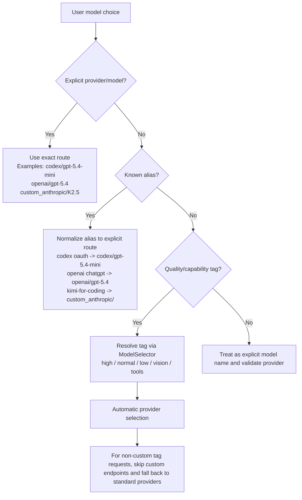

# Model Routing Precedence

Pantheon now resolves chat model choices in one explicit order so that
`codex`, `openai`, and configured Kimi coding endpoints do not silently
override one another.

## Final precedence

## Why this matters

- Explicit provider routes always win.
- Friendly aliases are converted once into explicit routes and then persisted.
- Tags still support automatic provider selection.
- Custom endpoints are only chosen automatically for explicit custom requests,
  not for unrelated `high` or `normal` tag resolutions.
