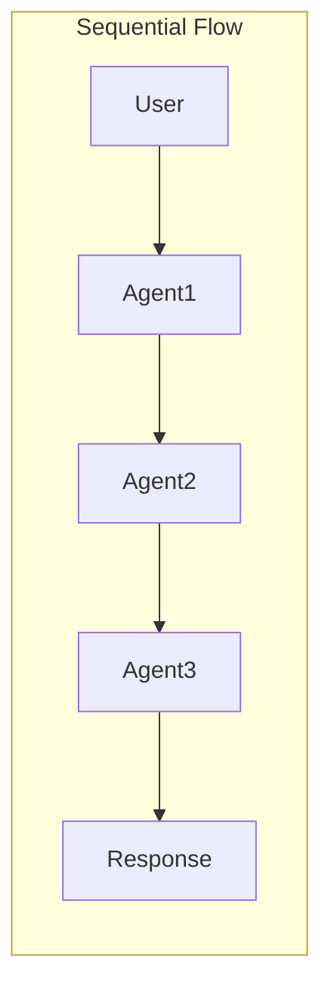
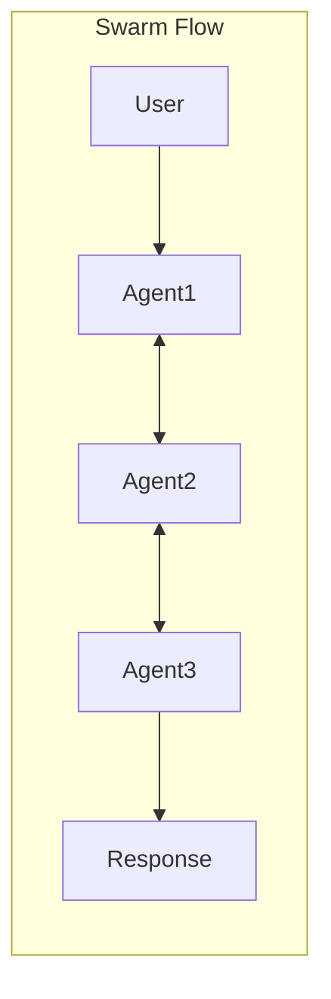
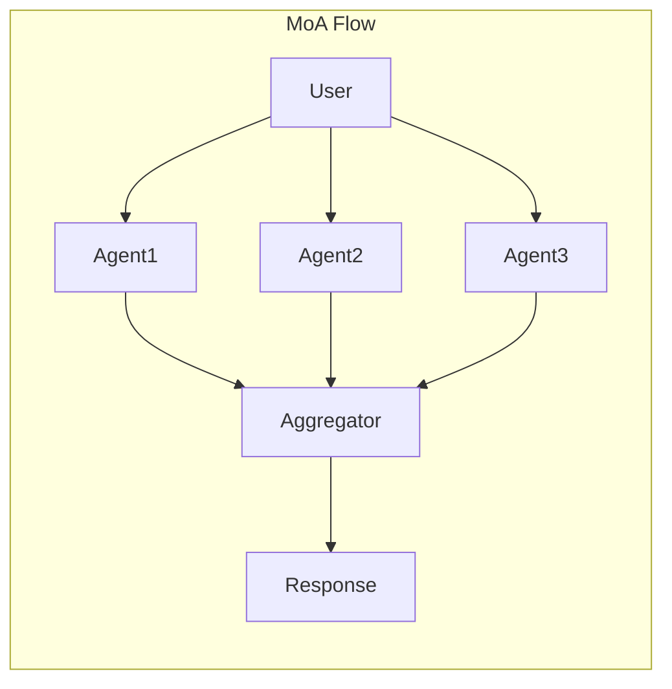

# Core Concepts

This section introduces the core concepts in Pantheon. Understanding these fundamental building blocks will help you effectively use the framework to build sophisticated multi-agent systems.

## Overview

Pantheon is built around several key abstractions that work together to create powerful AI systems:

- **Agents** - AI-powered entities with specific instructions and capabilities
- **Teams** - Collections of agents working together in coordinated patterns
- **Memory** - Systems for persisting information across interactions
- **Toolsets** - Functions and services that extend agent capabilities
- **Endpoints** - Network services for distributed deployment
- **ChatRooms** - Interactive interfaces for agent conversations

---

## Agent

An Agent is the fundamental building block in Pantheon - an AI-powered entity that can understand instructions, use tools, maintain memory, and collaborate with other agents.

### What is an Agent?

An agent in Pantheon is:

- **Autonomous**: Can make decisions and take actions independently
- **Tool-enabled**: Can use various tools to extend its capabilities
- **Stateful**: Maintains context and memory across interactions
- **Collaborative**: Can work with other agents in teams

### Core Components

The diagram above illustrates the core agent architecture:
- **Input/Output Flow**: Agents process input messages and generate outputs
- **Memory Integration**: Optional memory system for context persistence
- **Tool Execution**: Agents can invoke tools in parallel for enhanced capabilities
- **Results Processing**: Tool results are integrated back into the agent's reasoning

#### Instructions
Every agent has instructions that define its behavior and personality. These instructions serve as the agent's core directive, guiding its responses, approach, and interaction style. Well-crafted instructions are crucial for creating agents that behave consistently and effectively.

#### Tools and Capabilities
Agents become powerful through tools - functions that extend their abilities beyond pure conversation. Tools allow agents to interact with external systems, perform calculations, access databases, browse the web, execute code, and much more. The tool system is extensible, allowing you to add custom capabilities tailored to your specific needs.

### Advanced Features

#### Structured Output
Agents can return structured data in predefined formats rather than free-form text. This capability is essential for building reliable systems where agents need to produce consistent, parseable outputs. By defining schemas for responses, you ensure that agent outputs can be directly integrated into your application logic without complex parsing.

#### Remote Agents
Agents can run on remote machines and be accessed over the network. This distributed architecture enables you to deploy resource-intensive agents on powerful servers, share agents across multiple applications, and build scalable multi-agent systems. Remote agents maintain all the capabilities of local agents while providing network accessibility.

---

## Team

Teams in Pantheon enable multiple agents to collaborate on complex tasks. Different team structures support various collaboration patterns, from simple sequential processing to sophisticated multi-agent reasoning.

### What is a Team?

A team is a coordinated group of agents that:

- **Collaborate**: Work together towards a common goal
- **Specialize**: Each agent can focus on specific aspects
- **Communicate**: Share information and context
- **Coordinate**: Follow structured interaction patterns

### Team Types

#### Sequential Team
Agents process tasks in a predefined order, with each agent building on the previous one's output. This creates a pipeline where each agent specializes in one stage of a multi-step process.

**Use Cases:**
- Multi-step workflows
- Progressive refinement
- Pipeline processing

#### Swarm Team
Agents can dynamically transfer control to each other based on the task requirements. This creates a flexible system where the conversation flow adapts based on the specific needs of each interaction.

**Use Cases:**
- Dynamic routing
- Specialized handling
- Flexible workflows

#### SwarmCenter Team
A central coordinator agent manages and delegates tasks to worker agents. The coordinator analyzes incoming requests and intelligently distributes work to the most appropriate specialists.

**Use Cases:**
- Task distribution
- Centralized management
- Load balancing

#### Mixture of Agents (MoA) Team
Multiple agents work on the same problem independently, then their outputs are synthesized. This ensemble approach leverages diverse perspectives and reasoning strategies to produce more robust and comprehensive solutions.

**Use Cases:**
- Ensemble reasoning
- Diverse perspectives
- Robust solutions

### Team Coordination

#### Message Flow
Teams manage message flow between agents:

#### Context Sharing
Teams share context between agents to maintain continuity and accumulate knowledge throughout the collaboration. This enables agents to build upon each other's work, share discovered information, and maintain a coherent understanding of the task at hand. Context sharing is crucial for complex tasks that require multiple agents to work together effectively.

---

## Memory

Memory systems in Pantheon enable agents to maintain context, learn from interactions, and share knowledge. This persistence is crucial for building agents that can handle complex, multi-turn conversations and collaborative tasks.

### What is Memory?

Memory in Pantheon provides:

- **Persistence**: Information survives beyond single interactions
- **Context**: Agents remember previous conversations
- **Learning**: Agents can accumulate knowledge over time
- **Sharing**: Multiple agents can access common information

TODO

## Toolset

Toolsets extend agent capabilities by providing access to external functions, APIs, and services. They bridge the gap between AI reasoning and real-world actions.

### What is a Toolset?

A toolset is a collection of functions that agents can use to:

- **Execute Code**: Run Python, R, or shell commands
- **Access Information**: Browse web, query databases
- **Manipulate Files**: Read, write, edit files
- **Integrate Services**: Connect to external APIs
- **Perform Computations**: Complex calculations and analysis

### Built-in Toolsets

#### Python Interpreter
Execute Python code in a sandboxed environment. This toolset provides agents with the ability to perform data analysis, numerical computations, and general-purpose programming tasks in a secure, isolated environment.

#### Web Browsing
Search and fetch web content. This toolset enables agents to access current information from the internet, conduct research, and gather data from web sources.

### Creating Custom Tools

#### Simple Function Tools
Convert any Python function into a tool that agents can use. Functions are automatically introspected to understand their parameters and return types, making them immediately accessible to agents. The function's docstring serves as the tool's description, helping agents understand when and how to use it.

#### Async Tools
Support for asynchronous operations allows tools to perform network requests, database queries, and other I/O-bound operations efficiently. Async tools enable agents to handle time-consuming operations without blocking, making them ideal for integrating with external services and APIs.

---

## Endpoint

Endpoints in Pantheon enable distributed deployment of agents and toolsets by exposing them as network services. This allows for scalable, modular architectures where components can run on different machines.

### What is an Endpoint?

An endpoint is a network-accessible service that:

- **Exposes Functionality**: Makes agents or tools available over the network
- **Enables Distribution**: Allows components to run on different machines
- **Provides APIs**: Offers standardized interfaces for communication
- **Supports Scaling**: Facilitates horizontal scaling of services

### Types of Endpoints

#### Agent Endpoints
Deploy agents as standalone services that can be accessed remotely. Agent endpoints make it possible to run specialized agents on dedicated hardware, share agents across multiple applications, and build distributed multi-agent systems where agents communicate across network boundaries.

#### Toolset Endpoints
Expose toolsets as services that agents can connect to remotely. This separation allows resource-intensive tools (like code execution environments) to run on specialized infrastructure while keeping agents lightweight. Toolset endpoints enable secure, scalable deployment of potentially dangerous operations.

### Deployment Patterns

#### Microservices Architecture
Deploy each component as a separate service in a microservices architecture. This pattern enables independent scaling, isolated failures, and flexible deployment strategies. Each agent, toolset, and service can be updated, scaled, and managed independently, providing maximum flexibility for complex systems.

---

## ChatRoom

ChatRoom is an interactive service that provides a user-friendly interface for conversations with agents and teams. It manages sessions, handles real-time communication, and integrates with web UIs.

### What is a ChatRoom?

A ChatRoom is a service layer that:

- **Hosts Conversations**: Manages interactive sessions with agents
- **Provides Interface**: Offers web UI and API access
- **Manages State**: Maintains conversation history and context
- **Handles Concurrency**: Supports multiple simultaneous users
- **Enables Persistence**: Saves and restores chat sessions

### Core Features

#### Session Management
ChatRooms manage user sessions automatically, handling multiple concurrent conversations while maintaining isolation between users. Each session maintains its own conversation history, context, and state, ensuring privacy and coherent interactions.

#### Web UI Integration
Connect to Pantheon's web interface for a rich, interactive chat experience. The web UI provides real-time messaging, conversation history, and a polished interface that makes it easy for users to interact with your agents and teams.

### Creating ChatRooms

#### Team ChatRoom
ChatRooms can host teams of agents working together. This enables sophisticated multi-agent interactions where users can benefit from the combined expertise of multiple specialized agents, all through a single conversational interface.

#### Configuration-based ChatRoom
Create ChatRooms from configuration files for easy deployment and management. Configuration-based setup allows you to define complex agent systems declaratively, making it simple to version control, share, and deploy your ChatRoom configurations across different environments.
